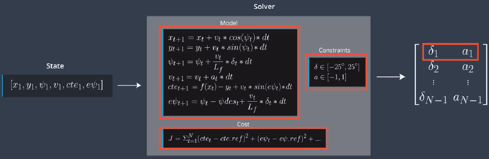
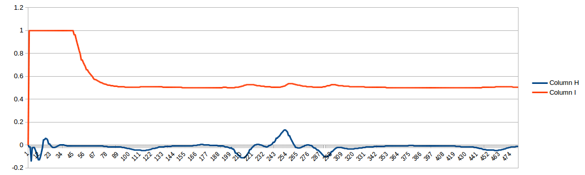

# CarND-Controls-MPC
### Self-Driving Car Engineer Nanodegree Program
#### Zhenglei 2018 April

https://github.com/lionzheng10/Carnd-MPC-control


## Intro
This project is my solution for the Udacity CarND MPC project. The goal of the project is to automaticaly drive the vehicle around the track in a simulator. 
The state of the vehicle was send to Cpp program from the simulator, and using MPC-control, I calculate the control signal(steering angle and throttle), and send the control signal to the simulator.

Below is video of the vehicle automatically driving.


## Model predictive control
Model Predictive Control reframes the task of following atrajectory as an ***optimization problem***. The solution to the optimization problem is the optimal trajectory.

Model Predictive Control involves simulating different actuator inputs, predicting the resulting trajectory and selecting that trajectory with a minimum cost.

Imagine that we know our current state and the reference trajectory we want to follow. We optimize our actuator inputs at each step in time in order to minimize the cost of our predicted trajectory. 

Once we found the lowest cost trajectory, we implement the very first set of actuation commands. Then, we throw away the rest of the trajectory we calculated. Instead of using the old trajectory we predicted, we take our new state and use that to calculate a new optimal trajectory.

In that sense, we are constantly calculating inputs over a future horzon. That's why this approach is sometimes called Receding Horizon Control.

## Global Kinematic Model

#### The model include 6 state variables.
- x // the x position of the vehicle
- y // the y position of the vehicle
- psi // the direction of the vehicle
- v // velocity of the vehicle
- cte // cross track error
- epsi // error between psi and road direction

#### The model also include 2 control actuators
- delta // steering angle(in rad)
- a // throttle


## Path planning
Autonomous vehicle system architecture starts with the perception system, which estimates the state of the surrounding environment including landmarks and vehicles and pedestrians. The localization block compares a model to a map to figure out where the vehicle is. The path planning block charts a trajectory using environmental model, the map and vehicle location. Finally, the control loop applies the actuators to follow this trajectory. Typically, the path planning block passes the reference trajectory to the control block as a plynominal. Third degree polynomials are common so they can fit most roads.

$$$
a_3*x^3 + a_2*x^2 + a_1*x + a_0
$$$


In my project I use polyfit function to create a polynominal of the road.

```
auto coeffs = polyfit(waypoints_x_eig, waypoints_y_eig, 3);
double cte = polyeval(coeffs, 0);  // px = 0, py = 0
double epsi = -atan(coeffs[1]);  // p
```

## Cost function
A good start to the cost function is to think of the error that you would like to minimize. For example, measuring the offset from the center of the lane, where the center of the lane can be called the reference, or desired, state.

We previously captured two errors in our state vector: cte and ephi.

If the goal is to move the vehicle from A to B then coming to a halt in the middle of the reference trajectory is a problem. A simple solution is a set of reference velocity , to cross functional penalize the vehicle for not maintaining that reference velocity.

## Model predictive control


Model predictive control uses an optimizer to find the control inputs and minimize the cost function. We actually only execute the very first set of the control inputs. This bring the vehicle to a new state and then you repeat the process.
First, we set up everything required for the model predictive control loop. This consists of defining the duration of the trajectory T, by choosing N and dt. 

In my project, I choose N=10 and dt=0.1, because the time diffrence between 2 simulator cycle is close to 0.1S.

```
const size_t N = 12;
const double dt = 0.05;
const int latency_ind = 2; //latency  in units of dt (100ms)

```
Next, we define the vehicle model and constraints such as actual limitations.


With the setup complete, we begin to state feedback loop. First, we pass the current state to the model predictive controller. Next, the optimization solver is called. The solver uses the initial state, the model constraints and cost function to return a vector of control inputs that minimize the cost function. The solver we'll use is called ***Ipopt***.




## Latency
In a real car, an actuation command won't execute instantly - there will be a delay as the command propagates through the system. A realistic delay might be on the order of 100 milliseconds.

This is a problem called "latency", and it's a difficult challenge for some controllers - like a PID controller - to overcome. But a Model Predictive Controller can adapt quite well because we can model this latency in the system.

I use the second output of the actuator. Because after latency, the second variable is on the time.

## Ipopt
https://projects.coin-or.org/Ipopt
Ipopt (Interior Point OPTimizer,pronounced eye-pea-Opt) is a software package for large-scale nonlinear optimization. It is designed to find(local) solutions of mathematical optimization problems of the form

```
min f(x)
x in R^n

s.t.           g_L <= g(x) <= g_U
               x_L <=  X   <= x_U
```
where `f(x): R^n --> R` is the objective function, and `g(x):R^n --> R^m` are the constraint functions. The vectors `g_L` and `g_U` denote the lower and upper bounds on the constraints, and the vectors `x_L` and `x_U` are the bounds on the variables `x`. The functions `f(x)` and `g(x)` can be nonlinear and nonconvex, but should be twice continuously differentiable. Note that equality constraints can be formulated in the above formulation by setting the corresponding components `g_L` and `g_U` to the same value.

## Analyze the road

In this project, we can read out the road from simulator.


## My tune history
1) Add steer/throttle change limit at main.cpp,
   Finally, this is no use. The cost function is include the limit.

2) Analyze actual throttle and steer value, after adding limits, the steer and throttle were looks like smooth.


4) modify the motion model


#The original Udacity Readme

# CarND-Controls-MPC
Self-Driving Car Engineer Nanodegree Program

## Dependencies

* cmake >= 3.5
 * All OSes: [click here for installation instructions](https://cmake.org/install/)
* make >= 4.1(mac, linux), 3.81(Windows)
  * Linux: make is installed by default on most Linux distros
  * Mac: [install Xcode command line tools to get make](https://developer.apple.com/xcode/features/)
  * Windows: [Click here for installation instructions](http://gnuwin32.sourceforge.net/packages/make.htm)
* gcc/g++ >= 5.4
  * Linux: gcc / g++ is installed by default on most Linux distros
  * Mac: same deal as make - [install Xcode command line tools]((https://developer.apple.com/xcode/features/)
  * Windows: recommend using [MinGW](http://www.mingw.org/)
* [uWebSockets](https://github.com/uWebSockets/uWebSockets)
  * Run either `install-mac.sh` or `install-ubuntu.sh`.
  * If you install from source, checkout to commit `e94b6e1`, i.e.
    ```
    git clone https://github.com/uWebSockets/uWebSockets
    cd uWebSockets
    git checkout e94b6e1
    ```
    Some function signatures have changed in v0.14.x. See [this PR](https://github.com/udacity/CarND-MPC-Project/pull/3) for more details.

* **Ipopt and CppAD:** Please refer to [this document](https://github.com/udacity/CarND-MPC-Project/blob/master/install_Ipopt_CppAD.md) for installation instructions.
* [Eigen](http://eigen.tuxfamily.org/index.php?title=Main_Page). This is already part of the repo so you shouldn't have to worry about it.
* Simulator. You can download these from the [releases tab](https://github.com/udacity/self-driving-car-sim/releases).
* Not a dependency but read the [DATA.md](./DATA.md) for a description of the data sent back from the simulator.


## Basic Build Instructions

1. Clone this repo.
2. Make a build directory: `mkdir build && cd build`
3. Compile: `cmake .. && make`
4. Run it: `./mpc`.

## Tips

1. It's recommended to test the MPC on basic examples to see if your implementation behaves as desired. One possible example
is the vehicle starting offset of a straight line (reference). If the MPC implementation is correct, after some number of timesteps
(not too many) it should find and track the reference line.
2. The `lake_track_waypoints.csv` file has the waypoints of the lake track. You could use this to fit polynomials and points and see of how well your model tracks curve. NOTE: This file might be not completely in sync with the simulator so your solution should NOT depend on it.
3. For visualization this C++ [matplotlib wrapper](https://github.com/lava/matplotlib-cpp) could be helpful.)
4.  Tips for setting up your environment are available [here](https://classroom.udacity.com/nanodegrees/nd013/parts/40f38239-66b6-46ec-ae68-03afd8a601c8/modules/0949fca6-b379-42af-a919-ee50aa304e6a/lessons/f758c44c-5e40-4e01-93b5-1a82aa4e044f/concepts/23d376c7-0195-4276-bdf0-e02f1f3c665d)
5. **VM Latency:** Some students have reported differences in behavior using VM's ostensibly a result of latency.  Please let us know if issues arise as a result of a VM environment.

## Editor Settings

We've purposefully kept editor configuration files out of this repo in order to
keep it as simple and environment agnostic as possible. However, we recommend
using the following settings:

* indent using spaces
* set tab width to 2 spaces (keeps the matrices in source code aligned)

## Code Style

Please (do your best to) stick to [Google's C++ style guide](https://google.github.io/styleguide/cppguide.html).

## Project Instructions and Rubric

Note: regardless of the changes you make, your project must be buildable using
cmake and make!

More information is only accessible by people who are already enrolled in Term 2
of CarND. If you are enrolled, see [the project page](https://classroom.udacity.com/nanodegrees/nd013/parts/40f38239-66b6-46ec-ae68-03afd8a601c8/modules/f1820894-8322-4bb3-81aa-b26b3c6dcbaf/lessons/b1ff3be0-c904-438e-aad3-2b5379f0e0c3/concepts/1a2255a0-e23c-44cf-8d41-39b8a3c8264a)
for instructions and the project rubric.

## Hints!

* You don't have to follow this directory structure, but if you do, your work
  will span all of the .cpp files here. Keep an eye out for TODOs.

## Call for IDE Profiles Pull Requests

Help your fellow students!

We decided to create Makefiles with cmake to keep this project as platform
agnostic as possible. Similarly, we omitted IDE profiles in order to we ensure
that students don't feel pressured to use one IDE or another.

However! I'd love to help people get up and running with their IDEs of choice.
If you've created a profile for an IDE that you think other students would
appreciate, we'd love to have you add the requisite profile files and
instructions to ide_profiles/. For example if you wanted to add a VS Code
profile, you'd add:

* /ide_profiles/vscode/.vscode
* /ide_profiles/vscode/README.md

The README should explain what the profile does, how to take advantage of it,
and how to install it.

Frankly, I've never been involved in a project with multiple IDE profiles
before. I believe the best way to handle this would be to keep them out of the
repo root to avoid clutter. My expectation is that most profiles will include
instructions to copy files to a new location to get picked up by the IDE, but
that's just a guess.

One last note here: regardless of the IDE used, every submitted project must
still be compilable with cmake and make./

## How to write a README
A well written README file can enhance your project and portfolio.  Develop your abilities to create professional README files by completing [this free course](https://www.udacity.com/course/writing-readmes--ud777).
